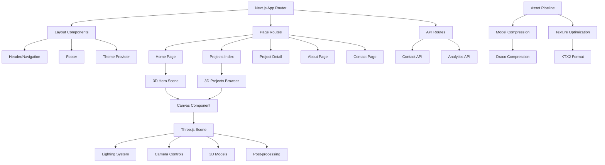

# Design Document

## Overview

This design document outlines the technical architecture for a modern 3D portfolio website built with Next.js 14, TypeScript, and react-three-fiber. The system implements a "Studio in the Cloud" concept featuring interactive 3D scenes with comprehensive fallback mechanisms for accessibility and performance.

The architecture prioritizes performance through code splitting, asset optimization, and progressive enhancement while maintaining full accessibility compliance and SEO optimization.

## Architecture

### High-Level Architecture



### Technology Stack

**Core Framework:**

- Next.js 14 with App Router for SSR/SSG capabilities
- TypeScript for type safety and developer experience
- React 18 with Suspense for progressive loading

**3D Rendering:**

- Three.js r158+ as the core 3D engine
- @react-three/fiber for React integration
- @react-three/drei for common 3D utilities
- @react-three/postprocessing for visual effects (selective)

**State Management:**

- Zustand for lightweight global state
- React Context for theme and settings
- URL state for filters and navigation

**UI Framework:**

- Tailwind CSS for utility-first styling
- shadcn/ui for accessible component primitives
- Framer Motion for non-3D animations

**Performance & Assets:**

- Draco compression for 3D models
- KTX2 texture format with basis universal
- next/image for optimized image delivery
- Dynamic imports for code splitting

## Components and Interfaces

### Core Component Structure

```typescript
// Core 3D Scene Interface
interface Scene3DProps {
  fallbackMode?: boolean;
  reducedMotion?: boolean;
  onInteraction?: (event: InteractionEvent) => void;
}

// Project Data Model
interface Project {
  slug: string;
  title: string;
  tagline: string;
  description: string;
  thumbnail: string;
  gallery: MediaItem[];
  stack: string[];
  role: string;
  year: number;
  links: {
    demo?: string;
    github?: string;
    case_study?: string;
  };
  badges: string[];
  priority: number;
  sceneRef?: {
    position: [number, number, number];
    rotation: [number, number, number];
    scale: number;
  };
}

// Settings Context
interface SettingsContext {
  theme: 'light' | 'dark' | 'system';
  lowPowerMode: boolean;
  reducedMotion: boolean;
  toggleTheme: () => void;
  toggleLowPower: () => void;
}
```

### 3D Scene Architecture

**HeroScene Component:**

- Manages the main 3D studio environment
- Handles project card positioning and interactions
- Implements camera controls with orbit constraints
- Provides keyboard navigation support

**ProjectsScene Component:**

- Creates dynamic 3D grid layouts for project browsing
- Implements real-time filtering with smooth transitions
- Manages LOD (Level of Detail) for performance
- Supports both orbital and grid arrangements

**Canvas Wrapper:**

- Provides WebGL capability detection
- Implements fallback rendering strategies
- Manages performance monitoring and adaptive quality
- Handles resize and device orientation changes

### Asset Management System

**Model Pipeline:**

1. Source models created in Blender (< 50k triangles per model)
2. Export to glTF 2.0 format with embedded textures
3. Apply Draco compression (position, normal, UV quantization)
4. Generate LOD variants for distance-based rendering
5. Bundle with metadata for scene positioning

**Texture Pipeline:**

1. Source textures in PNG/JPG format (max 2048x2048)
2. Convert to KTX2 with Basis Universal compression
3. Generate mipmaps for optimal filtering
4. Create WebP fallbacks for non-WebGL contexts
5. Implement lazy loading with intersection observer

## Data Models

### Content Structure

```typescript
// Project Content Model
interface ProjectContent {
  metadata: {
    slug: string;
    title: string;
    tagline: string;
    year: number;
    role: string;
    priority: number;
    featured: boolean;
  };
  content: {
    description: string; // Markdown
    challenge: string;
    solution: string;
    results: string[];
  };
  technical: {
    stack: TechStack[];
    architecture: string;
    highlights: string[];
  };
  media: {
    thumbnail: ImageAsset;
    hero: MediaAsset;
    gallery: MediaAsset[];
    demo_video?: VideoAsset;
  };
  links: {
    demo?: string;
    github?: string;
    case_study?: string;
  };
  scene: {
    model?: string;
    position: Vector3;
    rotation: Vector3;
    scale: number;
    animation?: AnimationClip;
  };
}

// Skills and About Data
interface SkillCategory {
  name: string;
  skills: {
    name: string;
    level: 'beginner' | 'intermediate' | 'advanced' | 'expert';
    years: number;
  }[];
}

interface TimelineItem {
  date: string;
  title: string;
  company: string;
  description: string;
  technologies: string[];
}
```

### State Management

**Global State (Zustand):**

```typescript
interface AppState {
  // Settings
  settings: SettingsContext;

  // 3D Scene State
  scene: {
    loaded: boolean;
    activeProject: string | null;
    cameraPosition: Vector3;
    performance: 'high' | 'medium' | 'low';
  };

  // Projects State
  projects: {
    items: Project[];
    filters: {
      technology: string[];
      year: number[];
      featured: boolean;
    };
    view: '3d' | 'list';
  };

  // Actions
  setActiveProject: (slug: string | null) => void;
  updateFilters: (filters: Partial<ProjectFilters>) => void;
  toggleView: () => void;
}
```

## Error Handling

### 3D Rendering Errors

**WebGL Context Loss:**

- Implement context restoration handlers
- Graceful fallback to static images
- User notification with retry option
- Automatic quality reduction on repeated failures

**Model Loading Failures:**

- Progressive fallback chain: Draco → glTF → placeholder
- Error boundaries around 3D components
- Loading state management with timeout handling
- Offline capability with cached assets

**Performance Degradation:**

- Real-time FPS monitoring with adaptive quality
- Automatic LOD switching based on performance
- Postprocessing effects disable on low performance
- Memory usage monitoring and cleanup

### API and Network Errors

**Contact Form Handling:**

```typescript
interface ContactFormError {
  field?: string;
  message: string;
  code: 'VALIDATION' | 'RATE_LIMIT' | 'SERVER_ERROR' | 'NETWORK';
}

// Error Recovery Strategy
const handleContactError = (error: ContactFormError) => {
  switch (error.code) {
    case 'RATE_LIMIT':
      return showRetryAfter(error.retryAfter);
    case 'VALIDATION':
      return highlightField(error.field, error.message);
    case 'NETWORK':
      return enableOfflineMode();
    default:
      return showGenericError();
  }
};
```

## Testing Strategy

### Unit Testing (Vitest + React Testing Library)

**Component Testing:**

- UI component rendering and interactions
- State management logic and reducers
- Utility functions and data transformations
- Form validation and error handling

**3D Component Testing:**

- Mock Three.js for component logic testing
- Test interaction handlers and state updates
- Verify fallback behavior and error boundaries
- Performance monitoring utilities

### Integration Testing

**API Route Testing:**

- Contact form submission and validation
- Rate limiting and security measures
- Email delivery and error handling
- Analytics event tracking

**Asset Loading Testing:**

- Model and texture loading pipelines
- Compression and optimization verification
- Fallback asset delivery
- Cache behavior and invalidation

### End-to-End Testing (Playwright)

**Critical User Journeys:**

1. **Home → Project Detail Flow:**
   - Load home page with 3D scene
   - Interact with project card
   - Navigate to project detail
   - Verify content and media loading

2. **Projects Browsing Flow:**
   - Access projects index
   - Apply technology filters
   - Switch between 3D and list views
   - Verify URL state persistence

3. **Accessibility Flow:**
   - Navigate entire site with keyboard only
   - Test screen reader compatibility
   - Verify reduced motion preferences
   - Test low power mode functionality

4. **Contact Form Flow:**
   - Fill and submit contact form
   - Test validation errors
   - Verify success/error states
   - Test spam protection

**Performance Testing:**

- Lighthouse CI integration
- Core Web Vitals monitoring
- 3D performance benchmarking
- Memory leak detection

### Visual Regression Testing

**Screenshot Comparison:**

- 3D scene rendering consistency
- UI component visual states
- Theme switching behavior
- Responsive design breakpoints

## Performance Optimization

### Code Splitting Strategy

```typescript
// Route-based splitting
const ProjectsPage = lazy(() => import('./pages/projects'));
const AboutPage = lazy(() => import('./pages/about'));

// Feature-based splitting
const Scene3D = lazy(() => import('./components/3d/Scene3D'));
const PostProcessing = lazy(() => import('./components/3d/PostProcessing'));

// Conditional loading
const Advanced3DFeatures = lazy(() =>
  import('./components/3d/Advanced').then(module => ({
    default: module.Advanced3DFeatures,
  }))
);
```

### Asset Optimization

**Model Optimization:**

- Polygon reduction with edge preservation
- Texture atlas generation for material consolidation
- Instanced rendering for repeated elements
- Frustum culling and occlusion detection

**Loading Strategy:**

- Critical path: HTML, CSS, minimal JS first
- Progressive enhancement: 3D assets after interaction
- Preload key assets on hover/focus
- Service worker for offline asset caching

### Memory Management

**3D Scene Cleanup:**

```typescript
const useSceneCleanup = () => {
  useEffect(() => {
    return () => {
      // Dispose geometries and materials
      scene.traverse(object => {
        if (object.geometry) object.geometry.dispose();
        if (object.material) {
          if (Array.isArray(object.material)) {
            object.material.forEach(material => material.dispose());
          } else {
            object.material.dispose();
          }
        }
      });

      // Clear texture cache
      renderer.dispose();
    };
  }, [scene, renderer]);
};
```

## Security Considerations

### Content Security Policy

```typescript
const cspHeader = `
  default-src 'self';
  script-src 'self' 'unsafe-eval' ${
    process.env.NODE_ENV === 'development' ? "'unsafe-inline'" : ''
  };
  style-src 'self' 'unsafe-inline';
  img-src 'self' blob: data: https:;
  font-src 'self';
  object-src 'none';
  base-uri 'self';
  form-action 'self';
  frame-ancestors 'none';
  upgrade-insecure-requests;
`;
```

### API Security

**Contact Form Protection:**

- Input sanitization and validation
- Rate limiting per IP address
- Honeypot fields for spam detection
- CSRF token validation
- Email content filtering

**Asset Security:**

- Signed URLs for sensitive assets
- CORS configuration for 3D models
- Content-Type validation
- File size limits and scanning

This design provides a comprehensive foundation for building a performant, accessible, and maintainable 3D portfolio website that meets all specified requirements while following modern web development best practices.
