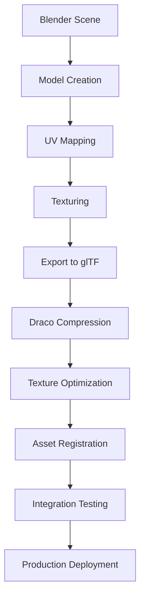

# 3D Asset Pipeline Documentation

This document outlines the complete workflow for creating, optimizing, and integrating 3D assets into the portfolio website.

## Overview

The asset pipeline transforms 3D models from creation in Blender to optimized web assets ready for real-time rendering. The pipeline emphasizes performance, visual quality, and maintainability.

## Pipeline Stages



## 1. Blender Setup and Requirements

### Software Requirements

- **Blender 3.6+** - Latest LTS version recommended
- **glTF-Blender-IO** - Built-in glTF 2.0 exporter
- **Node Wrangler** - For efficient material workflow

### Project Setup

1. **Units**: Set to Metric, Scale 1.0
2. **Render Engine**: Cycles or Eevee (for material preview)
3. **Color Management**: sRGB for textures, Linear for data

### Scene Organization

```
Collection Structure:
├── Projects/
│   ├── Project_Card_01
│   ├── Project_Card_02
│   └── Project_Card_03
├── Environment/
│   ├── Lighting
│   └── Background
└── References/
    ├── Guides
    └── Templates
```

## 2. Model Creation Guidelines

### Polygon Budget

- **Project Cards**: ≤ 5,000 triangles each
- **Environment Objects**: ≤ 2,000 triangles each
- **Detail Objects**: ≤ 1,000 triangles each
- **Total Scene**: ≤ 50,000 triangles

### Modeling Best Practices

- **Quad Topology**: Use quads for smooth surfaces
- **Edge Flow**: Follow natural surface flow
- **Manifold Geometry**: Ensure watertight meshes
- **Scale Consistency**: Use real-world scale (1 Blender unit = 1 meter)
- **Origin Points**: Set origins at logical positions (bottom center for cards)

### Optimization Techniques

- **Level of Detail (LOD)**: Create multiple detail levels
- **Instancing**: Reuse geometry where possible
- **Modifiers**: Use non-destructive modeling
- **Clean Geometry**: Remove doubles, fix normals

## 3. UV Mapping and Texturing

### UV Layout Guidelines

- **Texture Resolution**: 1024x1024 or 2048x2048 maximum
- **UV Seams**: Place seams in hidden areas
- **Texel Density**: Maintain consistent pixel density
- **UV Islands**: Minimize stretching and distortion

### Material Setup

```
Material Node Structure:
├── Principled BSDF
├── Image Texture Nodes
│   ├── Base Color (sRGB)
│   ├── Normal Map (Non-Color)
│   ├── Roughness (Non-Color)
│   └── Metallic (Non-Color)
└── UV Map Node
```

### Texture Types and Specifications

| Map Type   | Format  | Resolution  | Color Space |
| ---------- | ------- | ----------- | ----------- |
| Base Color | PNG/JPG | 1024-2048px | sRGB        |
| Normal     | PNG     | 1024-2048px | Non-Color   |
| Roughness  | PNG     | 1024px      | Non-Color   |
| Metallic   | PNG     | 1024px      | Non-Color   |
| Emission   | PNG/JPG | 1024px      | sRGB        |

### Texture Optimization

- **Texture Atlas**: Combine multiple objects into single texture
- **Channel Packing**: Pack grayscale maps (R=Metallic, G=Roughness, B=AO)
- **Compression**: Use appropriate compression for each map type
- **Mipmaps**: Ensure power-of-2 dimensions for mipmapping

## 4. Export Process

### Pre-Export Checklist

- [ ] Apply all modifiers
- [ ] Check mesh integrity (no non-manifold edges)
- [ ] Verify UV coordinates (0-1 range)
- [ ] Test materials in Eevee viewport
- [ ] Set proper object origins
- [ ] Name objects descriptively

### glTF Export Settings

```json
{
  "format": "GLB",
  "export_textures": true,
  "export_materials": "EXPORT",
  "export_colors": true,
  "export_cameras": false,
  "export_lights": false,
  "export_animations": true,
  "export_apply": true,
  "export_yup": true,
  "export_draco_mesh_compression_enable": false,
  "export_draco_mesh_compression_level": 6,
  "export_draco_position_quantization": 14,
  "export_draco_normal_quantization": 10,
  "export_draco_texcoord_quantization": 12
}
```

### Export Workflow

1. **Select Objects**: Choose objects for export
2. **Check Scale**: Verify 1 Blender unit = 1 meter
3. **Export Settings**: Use settings above
4. **File Naming**: Use descriptive, web-safe names
5. **Validation**: Test in glTF viewer

## 5. Post-Export Optimization

### Draco Compression

```bash
# Install gltf-pipeline
npm install -g gltf-pipeline

# Compress with Draco
gltf-pipeline -i model.glb -o model-compressed.glb --draco.compressionLevel=7
```

### Compression Settings

- **Position Quantization**: 14 bits (good quality)
- **Normal Quantization**: 10 bits (sufficient for most cases)
- **UV Quantization**: 12 bits (preserve texture quality)
- **Compression Level**: 7 (balanced size/quality)

### Texture Processing

```bash
# Convert to KTX2 with Basis Universal
toktx --bcmp --genmipmap texture.ktx2 texture.png

# WebP fallback generation
cwebp -q 85 texture.png -o texture.webp
```

## 6. Asset Registration

### Asset Metadata Structure

```typescript
// data/assets.ts
export const projectAssets = {
  'project-card-01': {
    model: '/models/project-card-01.glb',
    thumbnail: '/images/project-01-thumb.webp',
    position: [0, 0, 0],
    rotation: [0, 0, 0],
    scale: 1,
    lod: {
      high: '/models/project-card-01-high.glb',
      medium: '/models/project-card-01-medium.glb',
      low: '/models/project-card-01-low.glb',
    },
    materials: {
      baseColor: '/textures/project-01-base.ktx2',
      normal: '/textures/project-01-normal.ktx2',
      roughness: '/textures/project-01-roughness.ktx2',
    },
    metadata: {
      triangles: 4850,
      vertices: 2425,
      fileSize: '185KB',
      compressionRatio: 0.12,
    },
  },
};
```

### File Organization

```
public/
├── models/
│   ├── project-cards/
│   │   ├── card-01.glb
│   │   ├── card-01-lod1.glb
│   │   └── card-01-lod2.glb
│   └── environment/
│       ├── desk.glb
│       └── lighting.glb
├── textures/
│   ├── project-cards/
│   │   ├── card-01-base.ktx2
│   │   ├── card-01-normal.ktx2
│   │   └── card-01-roughness.ktx2
│   └── environment/
│       ├── desk-base.ktx2
│       └── desk-normal.ktx2
└── images/
    ├── thumbnails/
    └── fallbacks/
```

## 7. Integration and Testing

### Loading Strategy

```typescript
// components/3d/asset-loader.tsx
const useAssetLoader = (assetId: string) => {
  const { scene, materials, animations } = useGLTF(
    projectAssets[assetId].model,
    '/draco-gltf/'
  );

  // Apply LOD based on device performance
  const lodLevel = usePerformanceLevel();
  const lodModel = projectAssets[assetId].lod[lodLevel];

  return { scene, materials, animations };
};
```

### Performance Testing

- **Triangle Count**: Verify polygon budget compliance
- **File Size**: Check compressed asset sizes
- **Load Time**: Measure loading performance
- **Memory Usage**: Monitor GPU memory consumption
- **Frame Rate**: Test rendering performance

### Quality Assurance

- **Visual Comparison**: Compare with Blender viewport
- **Material Accuracy**: Verify PBR material translation
- **Animation Playback**: Test animation fidelity
- **Cross-Platform**: Test on different devices/browsers

## 8. Automation Scripts

### Asset Processing Script

```bash
#!/bin/bash
# scripts/process-assets.sh

# Process all GLB files in models directory
for file in public/models/**/*.glb; do
  echo "Processing $file..."

  # Compress with Draco
  gltf-pipeline -i "$file" -o "${file%.glb}-compressed.glb" --draco.compressionLevel=7

  # Generate LOD versions
  gltf-simplify -i "$file" -o "${file%.glb}-lod1.glb" -r 0.5
  gltf-simplify -i "$file" -o "${file%.glb}-lod2.glb" -r 0.25
done

# Process textures
for file in public/textures/**/*.png; do
  echo "Processing texture $file..."

  # Generate KTX2
  toktx --bcmp --genmipmap "${file%.png}.ktx2" "$file"

  # Generate WebP fallback
  cwebp -q 85 "$file" -o "${file%.png}.webp"
done
```

### Validation Script

```javascript
// scripts/validate-assets.js
const fs = require('fs');
const path = require('path');

const validateAssets = () => {
  const assetsDir = 'public/models';
  const maxFileSize = 500 * 1024; // 500KB
  const maxTriangles = 10000;

  fs.readdirSync(assetsDir).forEach(file => {
    const filePath = path.join(assetsDir, file);
    const stats = fs.statSync(filePath);

    if (stats.size > maxFileSize) {
      console.error(`❌ ${file} exceeds size limit: ${stats.size} bytes`);
    } else {
      console.log(`✅ ${file} size OK: ${stats.size} bytes`);
    }
  });
};

validateAssets();
```

## 9. Troubleshooting

### Common Issues

#### Export Problems

- **Missing Textures**: Ensure textures are packed or in relative paths
- **Wrong Scale**: Check export units and scene scale
- **Broken Materials**: Verify node setup and texture paths
- **Animation Issues**: Check keyframe types and interpolation

#### Compression Issues

- **Over-compression**: Reduce compression level if quality suffers
- **Decode Errors**: Check Draco decoder compatibility
- **Size Increase**: Some models may not benefit from compression

#### Performance Issues

- **High Triangle Count**: Use LOD system or reduce geometry
- **Large Textures**: Reduce resolution or use texture atlasing
- **Memory Leaks**: Ensure proper disposal of geometries and materials

### Debugging Tools

- **glTF Validator**: Validate exported files
- **Three.js Inspector**: Debug loaded models
- **Performance Monitor**: Track FPS and memory usage
- **Network Tab**: Monitor asset loading times

## 10. Best Practices Summary

### Modeling

- Keep polygon count within budget
- Use clean, manifold geometry
- Maintain consistent scale and naming
- Optimize for real-time rendering

### Texturing

- Use appropriate texture resolutions
- Pack channels efficiently
- Maintain consistent texel density
- Test materials in target environment

### Export

- Validate models before export
- Use consistent export settings
- Test in glTF viewers
- Document asset specifications

### Optimization

- Compress models with Draco
- Convert textures to KTX2
- Implement LOD system
- Monitor performance metrics

### Integration

- Register assets in metadata system
- Implement proper loading strategies
- Add error handling and fallbacks
- Test across different devices

This pipeline ensures consistent, high-quality 3D assets that perform well across all target devices while maintaining visual fidelity and development efficiency.
